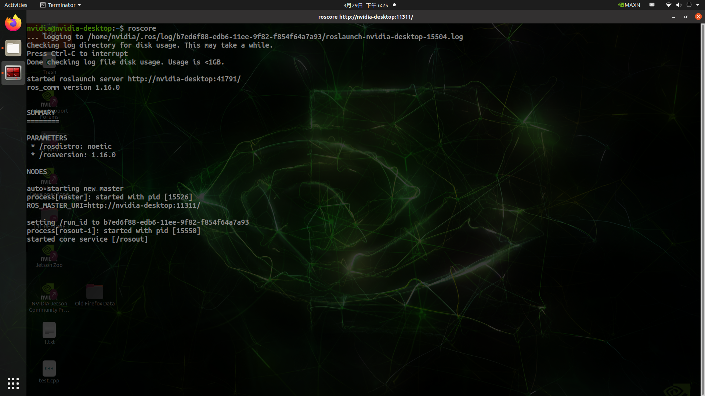
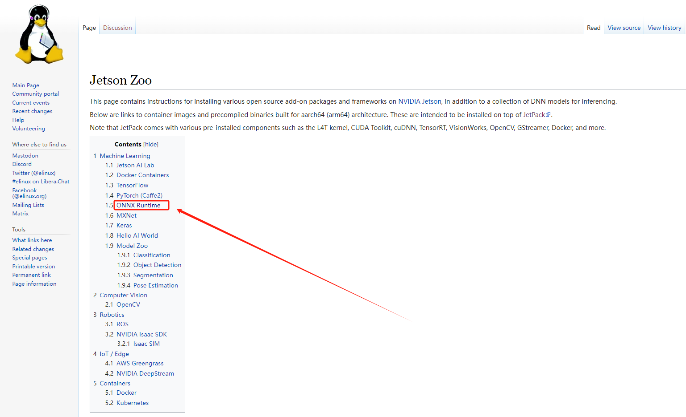
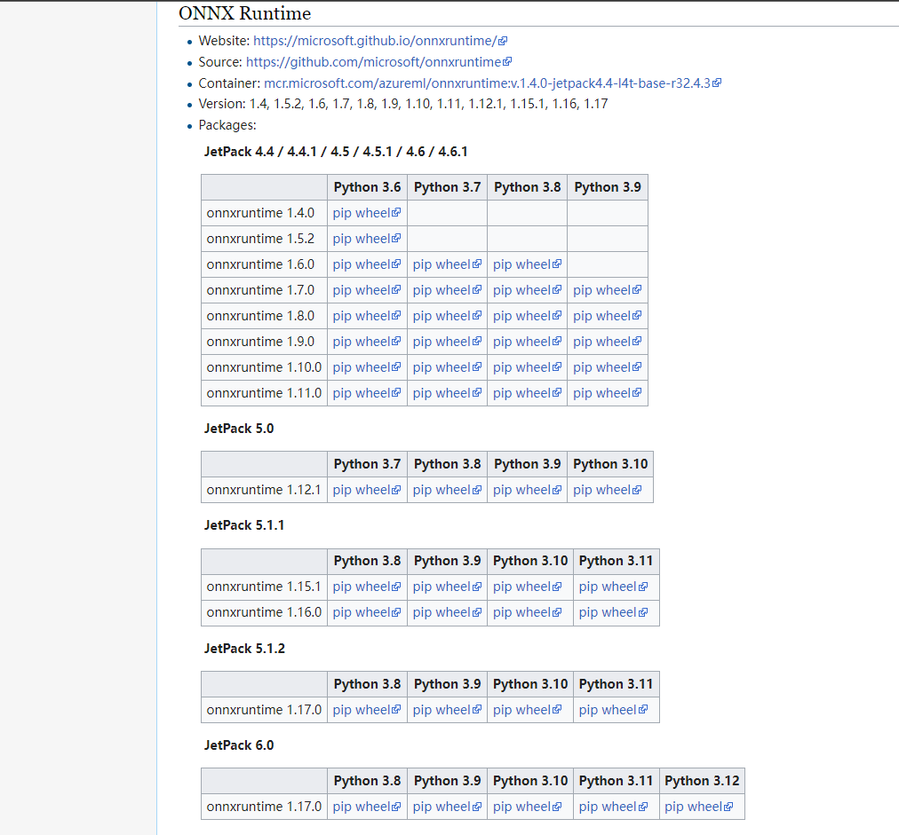

# 安装说明

## 1. 硬件要求

本工程代码在 `NVIDIA JetSon Orin NX` 上测试通过。

## 2. 软件要求

本工程代码在 `Jetpack 5.1.1` 上测试通过，使用的操作系统为 `Ubuntu 20.04`。

## 3. 环境配置

##### 3.1 TensorRT

本工程使用的 `TensorRT` 的版本为 `8.5.2.2`。

##### 3.2 ROS

本工程使用 `ROS` 进行前后端通信，`ROS` 版本为 `noetic`，你可以使用以下命令一键安装 `ROS`：

```bash
wget http://fishros.com/install -O fishros && . fishros
```

安装完成后，在终端输入以下命令进行测试：

```shell
roscore
```

如果输出以下内容，说明安装成功，按 `Ctrl+C` 退出即可。



##### 3.3 ONNX-Runtime

由于 `TensorRT` 暂时不支持 `EdgeSAM`，我们使用使用 `OnnxRuntime` 推理，请在[这里](https://elinux.org/JetSon_Zoo#ONNX_Runtime)下载对应的 `whl` 文件，如下图所示。然后使用 `pip install xxx.whl` 来安装，其中 `xxx.whl` 为你刚刚下载的 `whl` 文件。






##### 3.4 C++ 依赖

本工程依赖 `Eigen` 和 `OpenCV` 库，请检查 `/usr/include/` 目录下是否存在名为 `Eigen` 和 `opencv2` 文件夹，如果没有，请执行以下命令生成软链接：

```shell
sudo ln -s /usr/include/eigen3/Eigen /usr/include/Eigen
sudo ln -s /usr/include/opencv4/opencv2 /usr/include/opencv2
```

##### 3.5 其他 Python 依赖

本工程前端使用 `PyAutoGUI` 获取屏幕分辨率，使用以下命令安装：

```shell
pip install pyautogui
```
